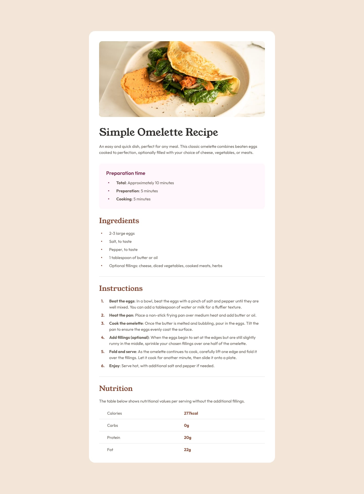

# frontendmentor-projects
Repositório dedicado aos desafios desenvolvidos a partir da plataforma Frontend Mentor, com foco na prática de desenvolvimento web, aprimoramento de habilidades e evolução contínua.

## Desafio | Projeto 01
Recriar um template simples com HTML e CSS de uma página de receitas

