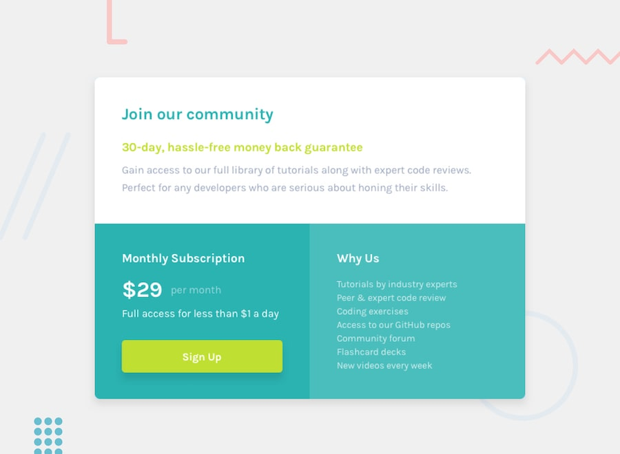

# frontendmentor-projects

Repositório dedicado aos desafios desenvolvidos a partir da plataforma Frontend Mentor, com foco na prática de desenvolvimento web, aprimoramento de habilidades e evolução contínua.

## desafio | Projeto 11

Construir um componente de grade de preço e fazer com que ele pareça o mais próximo possível do design.

